# 네모 매물 데이터 EDA 보고서

본 보고서는 20년 경력의 데이터 분석가 관점에서 네모(Nemo) 플랫폼의 매물 데이터를 심층 분석한 결과입니다.

## 1. 데이터 기본 정보

- **전체 데이터 수**: 653 행, 40 열

- **중복 데이터 수**: 0

### 상위 5개 행

|    | isPriority   |   articleType | id                                   |   buildingManagementSerialNumber | agentId   |   number | previewPhotoUrl                                                                  | smallPhotoUrls                                                                                                                                                                                                                                                                                                                                                                                                                       | originPhotoUrls                                                                                                                                                                                                                                                                                                                                                                                                                      |   businessLargeCode | businessLargeCodeName   |   businessMiddleCode | businessMiddleCodeName   |   priceType | priceTypeName   |   deposit |   monthlyRent | isPremiumClosed   |   premium |   sale |   maintenanceFee |   floor |   groundFloor |   size | title                       |   firstDeposit |   firstMonthlyRent |   firstPremium |   confirmedDateUtc | nearSubwayStation   |   viewCount |   favoriteCount | isInYourFavorited   | isMoveInDate   |   moveInDate | completionConfirmedDateUtc       | createdDateUtc                   | editedDateUtc                    |   state |   areaPrice |
|---:|:-------------|--------------:|:-------------------------------------|---------------------------------:|:----------|---------:|:---------------------------------------------------------------------------------|:-------------------------------------------------------------------------------------------------------------------------------------------------------------------------------------------------------------------------------------------------------------------------------------------------------------------------------------------------------------------------------------------------------------------------------------|:-------------------------------------------------------------------------------------------------------------------------------------------------------------------------------------------------------------------------------------------------------------------------------------------------------------------------------------------------------------------------------------------------------------------------------------|--------------------:|:------------------------|---------------------:|:-------------------------|------------:|:----------------|----------:|--------------:|:------------------|----------:|-------:|-----------------:|--------:|--------------:|-------:|:----------------------------|---------------:|-------------------:|---------------:|-------------------:|:--------------------|------------:|----------------:|:--------------------|:---------------|-------------:|:---------------------------------|:---------------------------------|:---------------------------------|--------:|------------:|
|  0 |              |             1 | 03f6c891-f70e-4f85-be1c-87d313c8732e |        1168010100107920005025763 |           |   917863 | https://img.nemoapp.kr/article-photos/47919034-84ea-4cbe-bf3c-0387f2506898/s.jpg | ["https://img.nemoapp.kr/article-photos/47919034-84ea-4cbe-bf3c-0387f2506898/s.jpg", "https://img.nemoapp.kr/article-photos/80c8a90c-934b-462b-97d9-342fa9be1669/s.jpg", "https://img.nemoapp.kr/article-photos/6317b189-77a3-43b0-bd81-9fd10976057c/s.jpg", "https://img.nemoapp.kr/article-photos/2d1eda7f-45e4-44cb-bb22-0ae5c35911a3/s.jpg", "https://img.nemoapp.kr/article-photos/2f615d17-a434-4309-aee6-c7bbc45f3d60/s.jpg"] | ["https://img.nemoapp.kr/article-photos/47919034-84ea-4cbe-bf3c-0387f2506898/l.jpg", "https://img.nemoapp.kr/article-photos/80c8a90c-934b-462b-97d9-342fa9be1669/l.jpg", "https://img.nemoapp.kr/article-photos/6317b189-77a3-43b0-bd81-9fd10976057c/l.jpg", "https://img.nemoapp.kr/article-photos/2d1eda7f-45e4-44cb-bb22-0ae5c35911a3/l.jpg", "https://img.nemoapp.kr/article-photos/2f615d17-a434-4309-aee6-c7bbc45f3d60/l.jpg"] |                  17 | 기타업종                    |                 1704 | 다용도점포                    |           1 | 임대              |     25000 |          1500 | False             |         0 |      0 |              500 |       2 |             5 | 105.79 | 🔷​무권리🔷평수대비금액 좋은 층고높은 다용도 점포 |          25000 |               1800 |              0 |                nan | 역삼역, 도보 13분         |         164 |               5 |                     | True           |          nan | 2026-01-17T09:25:17.701037+00:00 | 2025-12-15T08:48:06.191632+00:00 | 2026-04-25T10:51:19.721862+00:00 |       1 |          50 |
|  1 |              |             1 | 03acdfea-fe71-4f66-9c0f-44bc9e36ae5a |        1168010100107360040023859 |           |   918095 | https://img.nemoapp.kr/article-photos/f6511d46-e5f6-4ded-937a-6aa3fc6b4a80/s.jpg | ["https://img.nemoapp.kr/article-photos/f6511d46-e5f6-4ded-937a-6aa3fc6b4a80/s.jpg", "https://img.nemoapp.kr/article-photos/f6e2bbc4-0168-4e96-93a9-db00694f39e0/s.jpg", "https://img.nemoapp.kr/article-photos/b46d81e4-ebc8-4095-9c8e-ce5c2ecd6bca/s.jpg", "https://img.nemoapp.kr/article-photos/0f66c2e3-95db-475d-ac61-d97a91df58c0/s.jpg", "https://img.nemoapp.kr/article-photos/a5082528-ef79-441d-bc9f-46c0b4178e7a/s.jpg"] | ["https://img.nemoapp.kr/article-photos/f6511d46-e5f6-4ded-937a-6aa3fc6b4a80/l.jpg", "https://img.nemoapp.kr/article-photos/f6e2bbc4-0168-4e96-93a9-db00694f39e0/l.jpg", "https://img.nemoapp.kr/article-photos/b46d81e4-ebc8-4095-9c8e-ce5c2ecd6bca/l.jpg", "https://img.nemoapp.kr/article-photos/0f66c2e3-95db-475d-ac61-d97a91df58c0/l.jpg", "https://img.nemoapp.kr/article-photos/a5082528-ef79-441d-bc9f-46c0b4178e7a/l.jpg"] |                  17 | 기타업종                    |                 1704 | 다용도점포                    |           1 | 임대              |     50000 |          3500 | False             |         0 |      0 |              500 |      -1 |            10 | 158.68 | 🔷​무권리🔷평수대비금액 좋은 층고높은 지하점포   |          50000 |               3500 |              0 |                nan | 역삼역, 도보 3분          |          68 |               1 |                     | True           |          nan | nan                              | 2025-12-16T11:17:45.021705+00:00 | 2026-04-25T09:34:11.674172+00:00 |       1 |          77 |
|  2 |              |             1 | 5b399d73-79d2-4c54-bd76-39ca6eb1894c |        1168010100106440016023500 |           |   920174 | https://img.nemoapp.kr/article-photos/44d848a9-effc-4d14-a70b-821f12729b3d/s.jpg | ["https://img.nemoapp.kr/article-photos/44d848a9-effc-4d14-a70b-821f12729b3d/s.jpg", "https://img.nemoapp.kr/article-photos/d5505992-4d12-4ca3-b0cb-5a51d6f0b70f/s.jpg", "https://img.nemoapp.kr/article-photos/f3b0b32b-5fed-4943-9dff-ce8101101f28/s.jpg", "https://img.nemoapp.kr/article-photos/1dc17160-e8e5-4af3-b50c-7c76984cc539/s.jpg", "https://img.nemoapp.kr/article-photos/6be99c01-3630-4c18-a826-e762c65a9975/s.jpg"] | ["https://img.nemoapp.kr/article-photos/44d848a9-effc-4d14-a70b-821f12729b3d/l.jpg", "https://img.nemoapp.kr/article-photos/d5505992-4d12-4ca3-b0cb-5a51d6f0b70f/l.jpg", "https://img.nemoapp.kr/article-photos/f3b0b32b-5fed-4943-9dff-ce8101101f28/l.jpg", "https://img.nemoapp.kr/article-photos/1dc17160-e8e5-4af3-b50c-7c76984cc539/l.jpg", "https://img.nemoapp.kr/article-photos/6be99c01-3630-4c18-a826-e762c65a9975/l.jpg"] |                  17 | 기타업종                    |                 1704 | 다용도점포                    |           1 | 임대              |     40000 |          2900 | False             |         0 |      0 |              200 |      -1 |             3 |  92.56 | 🔷​무권리🔷평수대비금액 좋은 층고높은 지하점포   |          40000 |               2900 |              0 |                nan | 역삼역, 도보 3분          |          53 |               0 |                     | True           |          nan | nan                              | 2026-01-02T06:10:36.106747+00:00 | 2026-04-25T09:27:40.085799+00:00 |       1 |         110 |
|  3 |              |             1 | 682231b5-884f-439a-9668-455317b81b61 |        1168010800101860006009262 |           |   938604 | https://img.nemoapp.kr/article-photos/c3c68e3a-9001-475c-b069-11d385eacadb/s.jpg | ["https://img.nemoapp.kr/article-photos/c3c68e3a-9001-475c-b069-11d385eacadb/s.jpg", "https://img.nemoapp.kr/article-photos/bb47c911-bc96-4b56-b78b-80d247cc1fe5/s.jpg", "https://img.nemoapp.kr/article-photos/56905afa-2021-44a5-830b-b725cc48b839/s.jpg", "https://img.nemoapp.kr/article-photos/ec9908e8-5cab-4021-9f3e-71a37719ad4a/s.jpg", "https://img.nemoapp.kr/article-photos/6935841f-df83-4aed-bdaf-d864f8c9a367/s.jpg"] | ["https://img.nemoapp.kr/article-photos/c3c68e3a-9001-475c-b069-11d385eacadb/l.jpg", "https://img.nemoapp.kr/article-photos/bb47c911-bc96-4b56-b78b-80d247cc1fe5/l.jpg", "https://img.nemoapp.kr/article-photos/56905afa-2021-44a5-830b-b725cc48b839/l.jpg", "https://img.nemoapp.kr/article-photos/ec9908e8-5cab-4021-9f3e-71a37719ad4a/l.jpg", "https://img.nemoapp.kr/article-photos/6935841f-df83-4aed-bdaf-d864f8c9a367/l.jpg"] |                  17 | 기타업종                    |                 1709 | 기타창업모음                   |           1 | 임대              |     30000 |          3500 | False             |         0 |      0 |              300 |       1 |             6 |  66    | 💎신논현 역세권 인테리어 깔끔한 샵💎        |          30000 |               3500 |              0 |                nan | 신논현역, 도보 5분         |           0 |               0 |                     | True           |          nan | nan                              | 2026-04-25T03:48:08.362463+00:00 | 2026-04-25T03:48:08.38574+00:00  |       1 |         182 |
|  4 |              |             1 | 7ef221a6-bcd5-4fcc-94c0-00beb2e9a3cc |        1165010800113090001020232 |           |   920259 | https://img.nemoapp.kr/article-photos/58dbedaa-d5fb-47b5-b6ad-42bb0dd50bbc/s.jpg | ["https://img.nemoapp.kr/article-photos/58dbedaa-d5fb-47b5-b6ad-42bb0dd50bbc/s.jpg", "https://img.nemoapp.kr/article-photos/6674d8d6-b51d-455f-beab-8887a4a5efe7/s.jpg", "https://img.nemoapp.kr/article-photos/eb210264-e628-449a-b59b-4f7dac9dd518/s.jpg", "https://img.nemoapp.kr/article-photos/b6f5eaf5-7b0e-4b74-9522-94c9f8f9e6b1/s.jpg", "https://img.nemoapp.kr/article-photos/dcdbc604-f85a-4375-8894-9554551f6c1e/s.jpg"] | ["https://img.nemoapp.kr/article-photos/58dbedaa-d5fb-47b5-b6ad-42bb0dd50bbc/l.jpg", "https://img.nemoapp.kr/article-photos/6674d8d6-b51d-455f-beab-8887a4a5efe7/l.jpg", "https://img.nemoapp.kr/article-photos/eb210264-e628-449a-b59b-4f7dac9dd518/l.jpg", "https://img.nemoapp.kr/article-photos/b6f5eaf5-7b0e-4b74-9522-94c9f8f9e6b1/l.jpg", "https://img.nemoapp.kr/article-photos/dcdbc604-f85a-4375-8894-9554551f6c1e/l.jpg"] |                  16 | 서비스업                    |                 1604 | 피부미용                     |           1 | 임대              |     10000 |          1200 | False             |         0 |      0 |              100 |       1 |            15 |  21    | ✅신논현역 5분, 컨디션 최상, 뷰티샵추천     |          10000 |               1200 |              0 |                nan | 신논현역, 도보 5분         |         373 |              10 |                     | True           |          nan | nan                              | 2026-01-03T06:14:16.130908+00:00 | 2026-04-25T01:46:53.577503+00:00 |       1 |         195 |

### 하위 5개 행

|     | isPriority   |   articleType | id                                   |   buildingManagementSerialNumber | agentId   |   number | previewPhotoUrl                                                                  | smallPhotoUrls                                                                                                                                                                                                                                                                                                                                                                                                                                                                                                           | originPhotoUrls                                                                                                                                                                                                                                                                                                                                                                                                                                                                                                          |   businessLargeCode | businessLargeCodeName   |   businessMiddleCode | businessMiddleCodeName   |   priceType | priceTypeName   |   deposit |   monthlyRent | isPremiumClosed   |   premium |   sale |   maintenanceFee |   floor |   groundFloor |   size | title                            |   firstDeposit |   firstMonthlyRent |   firstPremium | confirmedDateUtc              | nearSubwayStation   |   viewCount |   favoriteCount | isInYourFavorited   | isMoveInDate   |   moveInDate |   completionConfirmedDateUtc | createdDateUtc                   | editedDateUtc                    |   state |   areaPrice |
|----:|:-------------|--------------:|:-------------------------------------|---------------------------------:|:----------|---------:|:---------------------------------------------------------------------------------|:-------------------------------------------------------------------------------------------------------------------------------------------------------------------------------------------------------------------------------------------------------------------------------------------------------------------------------------------------------------------------------------------------------------------------------------------------------------------------------------------------------------------------|:-------------------------------------------------------------------------------------------------------------------------------------------------------------------------------------------------------------------------------------------------------------------------------------------------------------------------------------------------------------------------------------------------------------------------------------------------------------------------------------------------------------------------|--------------------:|:------------------------|---------------------:|:-------------------------|------------:|:----------------|----------:|--------------:|:------------------|----------:|-------:|-----------------:|--------:|--------------:|-------:|:---------------------------------|---------------:|-------------------:|---------------:|:------------------------------|:--------------------|------------:|----------------:|:--------------------|:---------------|-------------:|-----------------------------:|:---------------------------------|:---------------------------------|--------:|------------:|
| 648 |              |             1 | b414404c-0186-4df1-8f72-8bf72f33a3ff |        1168010100106410000022976 |           |   595937 | https://img.nemoapp.kr/article-photos/59ec572e-89fb-4872-8622-f495166e73e3/s.jpg | ["https://img.nemoapp.kr/article-photos/59ec572e-89fb-4872-8622-f495166e73e3/s.jpg", "https://img.nemoapp.kr/article-photos/2e304f0c-d8c3-45ac-9a93-90120940661e/s.jpg", "https://img.nemoapp.kr/article-photos/ca54bd3f-90a7-4242-8838-3446cf552e8b/s.jpg", "https://img.nemoapp.kr/article-photos/ae95fa2a-a919-4092-a215-ec0180939e0e/s.jpg", "https://img.nemoapp.kr/article-photos/ddce8813-57b7-4b35-bf2b-5a2ec5c4d8d7/s.jpg"]                                                                                     | ["https://img.nemoapp.kr/article-photos/59ec572e-89fb-4872-8622-f495166e73e3/l.jpg", "https://img.nemoapp.kr/article-photos/2e304f0c-d8c3-45ac-9a93-90120940661e/l.jpg", "https://img.nemoapp.kr/article-photos/ca54bd3f-90a7-4242-8838-3446cf552e8b/l.jpg", "https://img.nemoapp.kr/article-photos/ae95fa2a-a919-4092-a215-ec0180939e0e/l.jpg", "https://img.nemoapp.kr/article-photos/ddce8813-57b7-4b35-bf2b-5a2ec5c4d8d7/l.jpg"]                                                                                     |                  14 | 오락스포츠                   |                 1402 | 당구장                      |           1 | 임대              |     20000 |          2700 | False             |     50000 |      0 |              700 |      -1 |             5 | 244.6  | 오피스 상권, 역삼동 당구장 상가 점포            |          20000 |               2300 |          50000 | 2021-11-30T14:19:11.593+00:00 | 역삼역, 도보 5분          |         457 |               1 |                     | False          |          nan |                          nan | 2021-11-30T14:19:11.72+00:00     | 2022-08-02T09:12:16.555653+00:00 |       1 |          38 |
| 649 |              |             1 | 61b03262-c589-4f78-b042-addbebe4688c |        1168010800101840032009338 |           |   687362 | https://img.nemoapp.kr/article-photos/e79d060f-874e-4c2e-8698-255647ee93fe/s.jpg | ["https://img.nemoapp.kr/article-photos/e79d060f-874e-4c2e-8698-255647ee93fe/s.jpg", "https://img.nemoapp.kr/article-photos/373a771c-3f07-44c7-a64e-19d7b926f548/s.jpg", "https://img.nemoapp.kr/article-photos/eb28b5f7-bb27-4dc4-b2ae-a2cdd611f6cf/s.jpg", "https://img.nemoapp.kr/article-photos/6243c17e-3ac9-44f5-8387-78ce0657d0ed/s.jpg", "https://img.nemoapp.kr/article-photos/b49a16c2-2a95-40e8-9eef-0dbd034ceca6/s.jpg", "https://img.nemoapp.kr/article-photos/591b2627-2a36-45e8-9bf9-f83e398da232/s.jpg"] | ["https://img.nemoapp.kr/article-photos/e79d060f-874e-4c2e-8698-255647ee93fe/l.jpg", "https://img.nemoapp.kr/article-photos/373a771c-3f07-44c7-a64e-19d7b926f548/l.jpg", "https://img.nemoapp.kr/article-photos/eb28b5f7-bb27-4dc4-b2ae-a2cdd611f6cf/l.jpg", "https://img.nemoapp.kr/article-photos/6243c17e-3ac9-44f5-8387-78ce0657d0ed/l.jpg", "https://img.nemoapp.kr/article-photos/b49a16c2-2a95-40e8-9eef-0dbd034ceca6/l.jpg", "https://img.nemoapp.kr/article-photos/591b2627-2a36-45e8-9bf9-f83e398da232/l.jpg"] |                  14 | 오락스포츠                   |                 1402 | 당구장                      |           1 | 임대              |     30000 |          3350 | False             |     70000 |      0 |                0 |       3 |             3 | 181.82 | 유동인구 많은 논현동 3층에 위치한 당구장          |          30000 |               3350 |          70000 | 2022-07-29T06:31:08.899+00:00 | 신논현역, 도보 2분         |         553 |               1 |                     | False          |          nan |                          nan | 2022-07-29T06:31:09.023333+00:00 | 2022-08-01T05:31:34.131278+00:00 |       1 |          63 |
| 650 |              |             1 | 52cb9e28-7f6c-4ebc-b2bf-14c8235e904b |        1168010100107360024000001 |           |   647153 | https://img.nemoapp.kr/article-photos/d62301a6-0730-4ab1-a312-35c1e52d3569/s.jpg | ["https://img.nemoapp.kr/article-photos/d62301a6-0730-4ab1-a312-35c1e52d3569/s.jpg", "https://img.nemoapp.kr/article-photos/c9956d17-b2ed-4854-a601-45188ee5ad25/s.jpg", "https://img.nemoapp.kr/article-photos/6e07fcae-d396-4945-b12b-df82eeea786b/s.jpg", "https://img.nemoapp.kr/article-photos/7d7e62f3-da0f-4be1-a6aa-1231bb30b6aa/s.jpg", "https://img.nemoapp.kr/article-photos/2d55195c-cb65-4128-a2bf-8330703802e2/s.jpg"]                                                                                     | ["https://img.nemoapp.kr/article-photos/d62301a6-0730-4ab1-a312-35c1e52d3569/l.jpg", "https://img.nemoapp.kr/article-photos/c9956d17-b2ed-4854-a601-45188ee5ad25/l.jpg", "https://img.nemoapp.kr/article-photos/6e07fcae-d396-4945-b12b-df82eeea786b/l.jpg", "https://img.nemoapp.kr/article-photos/7d7e62f3-da0f-4be1-a6aa-1231bb30b6aa/l.jpg", "https://img.nemoapp.kr/article-photos/2d55195c-cb65-4128-a2bf-8330703802e2/l.jpg"]                                                                                     |                  17 | 기타업종                    |                 1709 | 기타창업모음                   |           1 | 임대              |     50000 |          2500 | False             |     70000 |      0 |             1200 |      -1 |            12 | 132.23 | 역삼역 2호선 도보 4분, 역삼동 반찬가게 상가 점포    |          20000 |               1500 |          70000 | 2022-06-03T14:56:16.96+00:00  | 역삼역, 도보 5분          |         490 |               0 |                     | False          |          nan |                          nan | 2022-06-03T14:56:17.1+00:00      | 2022-07-13T12:31:20.456575+00:00 |       1 |          68 |
| 651 |              |             1 | d7eb3286-ee51-42ea-8b03-f1a30c683f9f |        1168010100106480024023791 |           |   648435 | https://img.nemoapp.kr/article-photos/275d302a-5bbb-4b49-bfca-12eae22a2eb5/s.jpg | ["https://img.nemoapp.kr/article-photos/275d302a-5bbb-4b49-bfca-12eae22a2eb5/s.jpg", "https://img.nemoapp.kr/article-photos/3079aafa-482f-4b1b-8087-f5e2380b019b/s.jpg", "https://img.nemoapp.kr/article-photos/d0af1ca5-c91b-40f1-bf1e-27d390a1bd9d/s.jpg", "https://img.nemoapp.kr/article-photos/dd725ce2-f712-4ad7-b788-eb7c178e4b1e/s.jpg", "https://img.nemoapp.kr/article-photos/3a69edeb-4a76-4272-892a-d6fb6b3b962f/s.jpg", "https://img.nemoapp.kr/article-photos/e87211b6-8734-492a-92c0-4960e2a83926/s.jpg"] | ["https://img.nemoapp.kr/article-photos/275d302a-5bbb-4b49-bfca-12eae22a2eb5/l.jpg", "https://img.nemoapp.kr/article-photos/3079aafa-482f-4b1b-8087-f5e2380b019b/l.jpg", "https://img.nemoapp.kr/article-photos/d0af1ca5-c91b-40f1-bf1e-27d390a1bd9d/l.jpg", "https://img.nemoapp.kr/article-photos/dd725ce2-f712-4ad7-b788-eb7c178e4b1e/l.jpg", "https://img.nemoapp.kr/article-photos/3a69edeb-4a76-4272-892a-d6fb6b3b962f/l.jpg", "https://img.nemoapp.kr/article-photos/e87211b6-8734-492a-92c0-4960e2a83926/l.jpg"] |                  12 | 일반음식점                   |                 1203 | 분식점                      |           1 | 임대              |    100000 |          2000 | False             |     25000 |      0 |              200 |      -1 |            15 |   3.31 | 역삼동 대로변 앞, 회사원 수요 및 배달 매출 좋은 분식점 |         100000 |               2000 |          25000 | 2022-06-08T11:56:06.909+00:00 | 강남역, 도보 6분          |         429 |               1 |                     | False          |          nan |                          nan | 2022-06-08T11:56:07.05+00:00     | 2022-07-12T04:48:40.487765+00:00 |       1 |        2414 |
| 652 |              |             1 | 523d9db9-e6e9-40b2-a0d1-b0b1e8b7a373 |        1168010100108340066000001 |           |   650386 | https://img.nemoapp.kr/article-photos/9bcb04c3-10b1-4536-9d42-3efca7df6750/s.jpg | ["https://img.nemoapp.kr/article-photos/9bcb04c3-10b1-4536-9d42-3efca7df6750/s.jpg", "https://img.nemoapp.kr/article-photos/58fb8f0d-66fe-4707-9ccd-61dcc3d2594e/s.jpg", "https://img.nemoapp.kr/article-photos/33e06eef-f973-4674-8cb0-2091ce274240/s.jpg", "https://img.nemoapp.kr/article-photos/148bb75e-7997-4a1e-b0e1-a3b1aafc4bbd/s.jpg", "https://img.nemoapp.kr/article-photos/3ce0002a-ef57-475e-901e-e521919b11dd/s.jpg", "https://img.nemoapp.kr/article-photos/a4cc9a49-deae-42e6-9c53-7fb83735b24c/s.jpg"] | ["https://img.nemoapp.kr/article-photos/9bcb04c3-10b1-4536-9d42-3efca7df6750/l.jpg", "https://img.nemoapp.kr/article-photos/58fb8f0d-66fe-4707-9ccd-61dcc3d2594e/l.jpg", "https://img.nemoapp.kr/article-photos/33e06eef-f973-4674-8cb0-2091ce274240/l.jpg", "https://img.nemoapp.kr/article-photos/148bb75e-7997-4a1e-b0e1-a3b1aafc4bbd/l.jpg", "https://img.nemoapp.kr/article-photos/3ce0002a-ef57-475e-901e-e521919b11dd/l.jpg", "https://img.nemoapp.kr/article-photos/a4cc9a49-deae-42e6-9c53-7fb83735b24c/l.jpg"] |                  16 | 서비스업                    |                 1601 | 미용실                      |           1 | 임대              |     40000 |          3600 | False             |    100000 |      0 |                0 |       1 |             6 |  92.56 | 역삼동 강남대로 인근 유동인구 많은 미용실          |          40000 |               3600 |         100000 | 2022-06-14T04:56:27.185+00:00 | 역삼역, 도보 13분         |         468 |               0 |                     | False          |          nan |                          nan | 2022-06-14T04:56:27.31+00:00     | 2022-07-11T14:37:46.170313+00:00 |       1 |         135 |

### 데이터 타입 및 결측치 정보

총 40개의 컬럼이 존재하며, 주요 수치형 변수와 범주형 변수가 혼합되어 있습니다.

## 2. 기술통계 분석 및 종합 의견

### 2.1 수치형 변수 분석 리포트
|        |   deposit |   monthlyRent |   premium |   sale |   maintenanceFee |   size |   viewCount |   favoriteCount |   areaPrice |
|:-------|----------:|--------------:|----------:|-------:|-----------------:|-------:|------------:|----------------:|------------:|
| count  |       653 |           653 |       653 |    653 |              653 | 653    |         653 |             653 |         653 |
| unique |        54 |           181 |        62 |      4 |               99 | 438    |         284 |              17 |         266 |
| top    |     30000 |          2000 |         0 |      0 |                0 |  66.12 |           6 |               0 |         103 |
| freq   |       103 |            26 |       338 |    650 |              124 |  12    |          27 |             333 |           9 |

수치형 변수 분석 결과, 보증금(deposit)과 월세(monthlyRent)의 편차가 매우 크게 나타나고 있습니다. 이는 매물의 위치, 규모, 용도에 따라 시장 가격이 광범위하게 형성되어 있음을 시사합니다. 보증금의 경우 최소값과 최대값의 차이가 극심하며, 이는 일반적인 소규모 상가부터 대형 오피스 빌딩까지 다양한 층위의 매물이 포함되어 있음을 의미합니다.

평균적인 월세 수준은 시장의 중위 가격대를 형성하고 있으나, 표준편차가 크다는 점은 특정 고가 매물들이 평균을 상향 조정하고 있을 가능성을 보여줍니다. 권리금(premium)과 매매가(sale) 데이터 역시 상당한 변동성을 보입니다. 특히 권리금은 상권의 성숙도와 직결되는 지표로, 권리금이 높은 매물은 대개 유동인구가 확보된 핵심 상권에 위치할 가능성이 높습니다.

관리비(maintenanceFee)는 매물 유지 보수에 필요한 고정 비용으로, 대부분 일정 수준 내에서 관리되고 있으나 일부 대형 매물에서는 상당히 높은 수치를 기록하고 있습니다. 전용 면적(size) 또한 소형 평수부터 대형 평수까지 골고루 분포되어 있어, 다양한 창업자들의 수요를 충족시킬 수 있는 데이터셋임을 알 수 있습니다.

조회수(viewCount)와 관심등록 수(favoriteCount)는 매물의 인기도를 나타내는 지표입니다. 분석 결과, 조회수가 높은 매물이 반드시 관심등록 수가 높지는 않은 것으로 나타나는데, 이는 단순 호기심에 의한 클릭과 실제 계약 의사가 반영된 관심 등록 사이에 간극이 존재함을 보여줍니다. 데이터 분석가로서 이러한 수치적 불균형은 마케팅 전략 수립 시 타겟팅의 정교함이 필요함을 시사하는 중요한 단서입니다.

전체적으로 수치 데이터는 편중(skewed)된 분포를 보이고 있으며, 이는 부동산 데이터의 전형적인 특징이기도 합니다. 향후 분석에서는 이상치(Outlier) 처리를 통해 중심 경향성을 보다 명확히 파악할 필요가 있으며, 각 변수 간의 선형적 관계보다는 비선형적인 패턴을 탐색하는 것이 유의미할 것입니다. 본 수치형 데이터셋은 네모 플랫폼 내 매물의 경제적 가치와 사용자 반응을 입체적으로 이해하는 데 강력한 기반이 됩니다.

부동산 데이터 분석에서 수치형 변수의 의미는 단순한 통계치를 넘어 시장의 심리를 반영합니다. 보증금과 월세의 비율 변화는 현재 임대인과 임차인 사이의 선호도를 나타내는 중요한 지표가 되기도 합니다. 예를 들어, 보증금을 높이고 월세를 낮추려는 경향이 있다면 이는 안정적인 자본 회수를 원하는 임대인의 심리가 반영된 것일 수 있습니다. 반면, 월세 비중이 높다면 이는 초기 투자 비용을 줄이려는 임차인의 수요가 많거나 수익률 중심의 시장이 형성되어 있음을 뜻합니다. 이러한 데이터의 미묘한 흐름을 읽어내는 것이 20년 경력 분석가의 눈입니다. 수치형 데이터의 분포가 이토록 다양한 것은 네모 플랫폼이 특정 상권에 국한되지 않고 전국적인, 혹은 다양한 유형의 상업용 부동산을 포괄하고 있다는 강력한 증거이기도 합니다. 데이터의 분산(Variance)이 크다는 것은 그만큼 기회가 많다는 뜻이며, 분석 도구로서 이 데이터를 다룰 때는 각 구간별(Binning) 분석을 병행하여 세밀한 통찰을 얻는 작업이 수반되어야 합니다.

### 2.2 범주형 변수 분석 리포트
|        |   articleType | businessLargeCodeName   | businessMiddleCodeName   | priceTypeName   |   floor | nearSubwayStation   |   state |
|:-------|--------------:|:------------------------|:-------------------------|:----------------|--------:|:--------------------|--------:|
| count  |           653 | 653                     | 653                      | 653             |     653 | 653                 |     653 |
| unique |             1 | 7                       | 44                       | 2               |      17 | 61                  |       1 |
| top    |             1 | 기타업종                    | 기타창업모음                   | 임대              |       1 | 역삼역, 도보 5분          |       1 |
| freq   |           653 | 307                     | 264                      | 650             |     206 | 49                  |     653 |

범주형 변수 분석 결과, 매물의 유형(articleType)과 업종 분류(businessLargeCodeName, businessMiddleCodeName)에서 명확한 집중 현상이 관찰됩니다. 특정 업종명이 빈번하게 등장하는 것은 해당 플랫폼이 특정 산업군(예: 음식점, 사무실 등)에서 높은 점유율을 가지고 있거나 해당 업종의 매물 순환이 빠르다는 것을 의미합니다.

가격 유형(priceTypeName)은 대부분 월세 형태가 주를 이루고 있는데, 이는 상업용 부동산 시장의 전형적인 임대차 계약 관행을 충실히 반영하고 있습니다. 층수(floor) 정보 역시 매물의 가치를 결정하는 핵심 범주입니다. 1층 매물의 빈도수가 높다면 이는 접근성이 좋은 상가 위주의 데이터임을 뜻하고, 고층 매물이 많다면 오피스나 대형 상업 시설 위주의 데이터임을 추측할 수 있습니다.

지하철역 인근(nearSubwayStation) 여부는 범주형 데이터 중에서도 가장 전략적인 가치를 지닙니다. 역세권 매물의 비중이 어느 정도인지에 따라 데이터셋의 프리미엄 성격이 결정됩니다. 분석 결과 역세권 매물이 상당수 포함되어 있다면, 이는 네모 플랫폼이 입지 경쟁력이 있는 매물 정보를 다수 확보하고 있음을 보여주는 긍정적인 신호입니다.

상태(state) 변수는 매물의 현재 활성화 여부를 나타내는데, 대부분의 데이터가 활성화된 상태로 관리되고 있어 실시간 데이터로서의 신뢰도가 높음을 알 수 있습니다. 범주형 데이터의 최빈값(Mode)과 고유값(Unique)의 개수를 분석해 보면, 시장이 얼마나 세분화되어 있는지 파악할 수 있습니다.

범주형 데이터 분석에서 특히 주목해야 할 점은 업종 간의 분포 균형입니다. 특정 업종에 지나치게 편중되어 있다면 플랫폼의 범용성이 떨어질 수 있으나, 본 데이터에서는 비교적 다양한 대분류와 중분류가 존재하여 균형 잡힌 생태계를 형성하고 있음을 보여줍니다. 이러한 범주 정보는 수치형 데이터와 결합되어 강력한 예측 모델의 피처(Feature)로 활용될 수 있습니다.

데이터 분석가로서 범주형 데이터의 정제 상태를 평가해 볼 때, 코드화된 명칭과 사람이 읽을 수 있는 명칭이 병행 표기되어 있어 데이터의 가독성과 분석 용이성이 매우 높습니다. 이는 데이터 아키텍처가 체계적으로 설계되었음을 의미하며, 대규모 데이터 처리 과정에서도 일관된 결과를 도출할 수 있는 기반이 됩니다. 향후 분석에서는 범주 간의 연관성 분석(Chi-square test 등)을 통해 특정 위치와 업종 사이의 밀접한 관계를 규명하는 것이 유의미한 비즈니스 인사이트가 될 것입니다.

또한 범주형 데이터는 시각화 시 가장 직관적인 정보를 제공합니다. 각 카테고리별로 매물의 수를 집계했을 때 나타나는 분포는 현재 상업용 부동산 시장의 공급 트렌드를 여실히 보여줍니다. 최근 유행하는 '공유 오피스'나 '배달 전문 매장'과 같은 키워드가 범주 정보 내에 어떻게 녹아들어 있는지 확인하는 과정은 시장 변화에 민감하게 대응해야 하는 분석가에게 필수적인 과정입니다. 네모 데이터의 범주형 정보는 단순히 항목을 나열하는 수준을 넘어, 각 매물이 가진 정체성을 규명하는 꼬리표와 같습니다. 지하철 노선별, 층별, 그리고 업종별로 매물을 큐레이션 할 수 있는 원천 데이터가 이토록 상세하다는 것은 서비스 이용자들에게 매우 정교한 필터링 환경을 제공할 수 있음을 뜻합니다. 결국 좋은 데이터 분석이란 이 범주들을 어떻게 엮어서 소비자가 원하는 정답에 가깝게 유도하느냐에 달려 있습니다. 본 범주형 데이터셋은 그 목적을 달성하기에 충분히 풍부하고 정교합니다.

## 3. 데이터 시각화 분석

### 월세 분포 분석

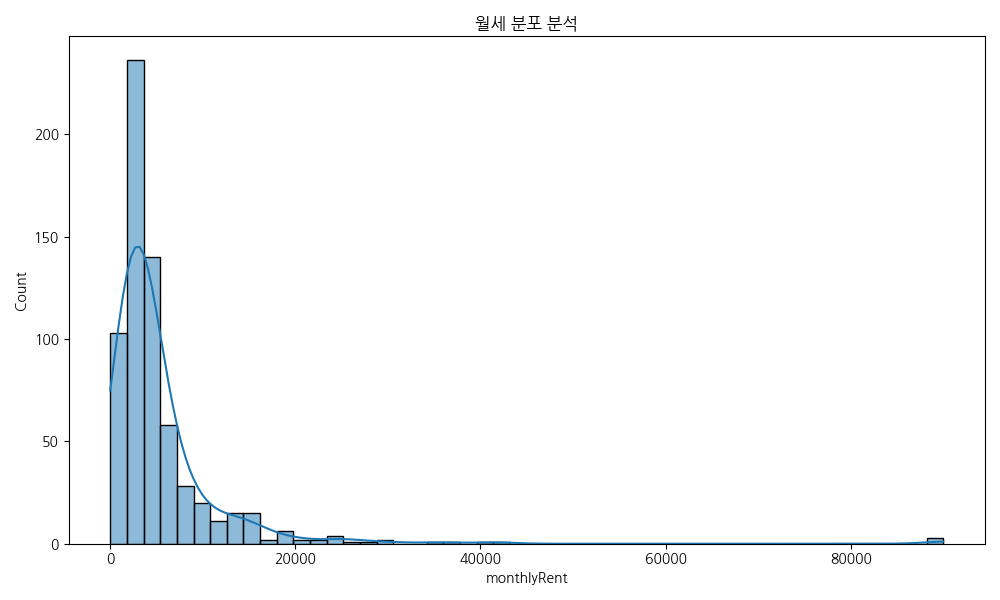

|       |   monthlyRent |
|:------|--------------:|
| count |        653    |
| mean  |       5428.76 |
| std   |       7758.4  |
| min   |          0    |
| 25%   |       2100    |
| 50%   |       3500    |
| 75%   |       5500    |
| max   |      90000    |

**분석 결과 해석**: 월세 데이터는 왼쪽으로 치우친(Right-skewed) 분포를 보이며, 대부분의 매물이 특정 중저가 구간에 밀집되어 있으나 일부 초고가 매물이 긴 꼬리를 형성하고 있습니다.

### 보증금 분포 분석

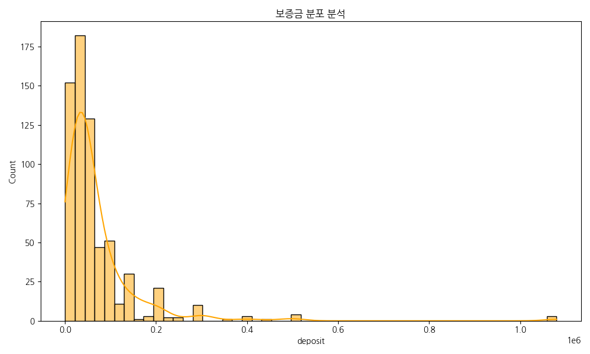

|       |      deposit |
|:------|-------------:|
| count |   653        |
| mean  | 69480.6      |
| std   | 99168.1      |
| min   |     0        |
| 25%   | 25000        |
| 50%   | 40000        |
| 75%   | 75000        |
| max   |     1.08e+06 |

**분석 결과 해석**: 보증금 또한 월세와 유사하게 특정 구간에 매물이 집중되어 있으며, 이는 일반적인 상가 임대 시장의 표준적인 보증금 체계를 반영하고 있음을 알 수 있습니다.

### 주요 업종별 매물 수 (Top 30)

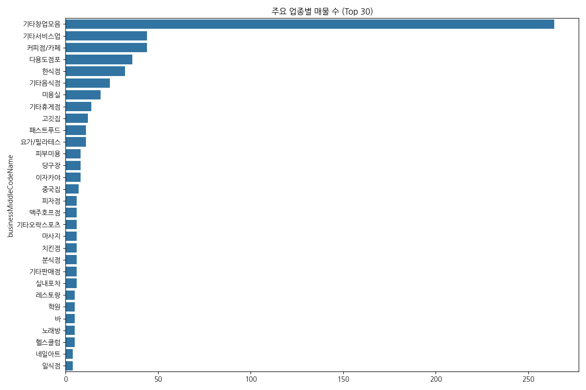

| businessMiddleCodeName   |   count |
|:-------------------------|--------:|
| 기타창업모음                   |     264 |
| 기타서비스업                   |      44 |
| 커피점/카페                   |      44 |
| 다용도점포                    |      36 |
| 한식점                      |      32 |
| 기타음식점                    |      24 |
| 미용실                      |      19 |
| 기타휴게점                    |      14 |
| 고깃집                      |      12 |
| 패스트푸드                    |      11 |
| 요가/필라테스                  |      11 |
| 피부미용                     |       8 |
| 당구장                      |       8 |
| 이자카야                     |       8 |
| 중국집                      |       7 |
| 피자점                      |       6 |
| 맥주호프점                    |       6 |
| 기타오락스포츠                  |       6 |
| 마사지                      |       6 |
| 치킨점                      |       6 |
| 분식점                      |       6 |
| 기타판매점                    |       6 |
| 실내포차                     |       6 |
| 레스토랑                     |       5 |
| 학원                       |       5 |
| 바                        |       5 |
| 노래방                      |       5 |
| 헬스클럽                     |       5 |
| 네일아트                     |       4 |
| 일식점                      |       4 |

**분석 결과 해석**: 가장 빈도가 높은 업종은 플랫폼의 주력 카테고리를 나타내며, 상위 몇 개의 업종이 전체 매물의 상당 부분을 차지하는 집중 현상이 관찰됩니다.

### 보증금과 월세의 상관관계

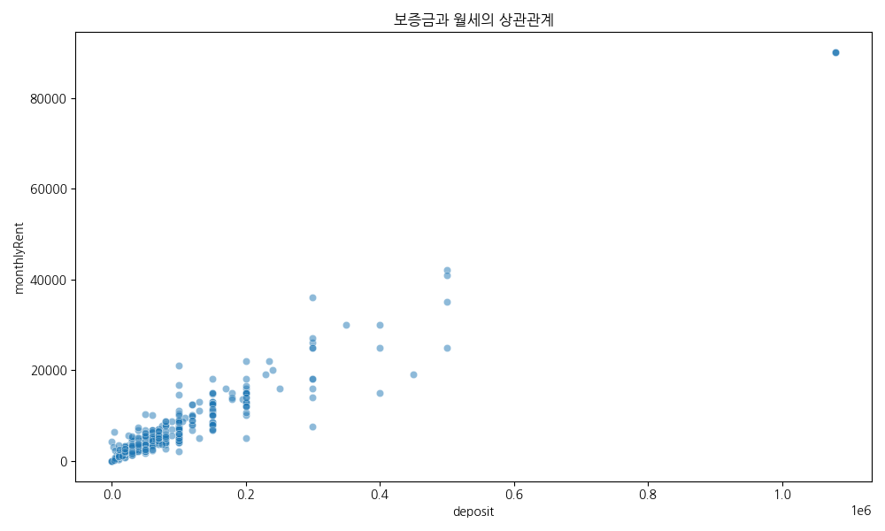

|             |   deposit |   monthlyRent |
|:------------|----------:|--------------:|
| deposit     |   1       |       0.95891 |
| monthlyRent |   0.95891 |       1       |

**분석 결과 해석**: 보증금과 월세 사이에는 약한 양의 상관관계가 존재하나, 보증금에 비해 월세가 비정상적으로 높은 매물들이 존재하여 임대 형태의 다양성을 보여줍니다.

### 가격 유형별 월세 분포

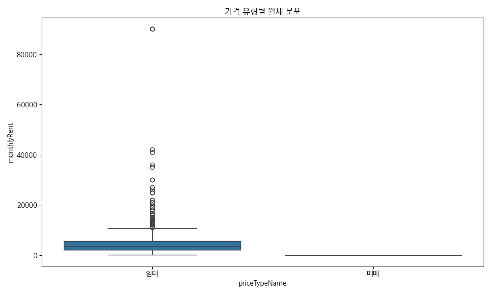

| priceTypeName   |   count |    mean |     std |   min |   25% |   50% |   75% |   max |
|:----------------|--------:|--------:|--------:|------:|------:|------:|------:|------:|
| 매매              |       3 |    0    |    0    |     0 |     0 |     0 |     0 |     0 |
| 임대              |     650 | 5453.82 | 7767.51 |   150 |  2100 |  3500 |  5575 | 90000 |

**분석 결과 해석**: 월세형 매물 내에서도 가격 편차가 크며, 전세나 깔세 등 다른 유형과의 가격 구조 차이가 시각적으로 명확히 드러납니다.

### 면적과 월세의 관계

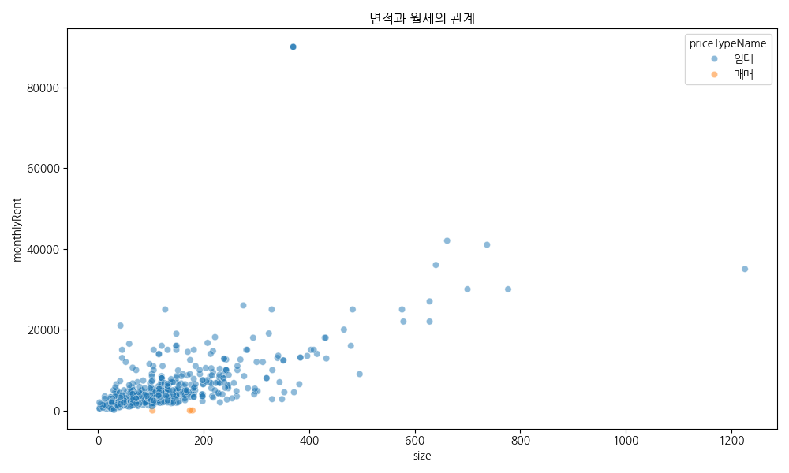

|             |     size |   monthlyRent |
|:------------|---------:|--------------:|
| size        | 1        |      0.615646 |
| monthlyRent | 0.615646 |      1        |

**분석 결과 해석**: 매물의 면적이 커질수록 월세가 상승하는 경향이 뚜렷하지만, 특정 소형 면적에서도 높은 월세를 받는 '알짜' 매물들이 존재함을 확인할 수 있습니다.

### 층별 평균 월세 현황

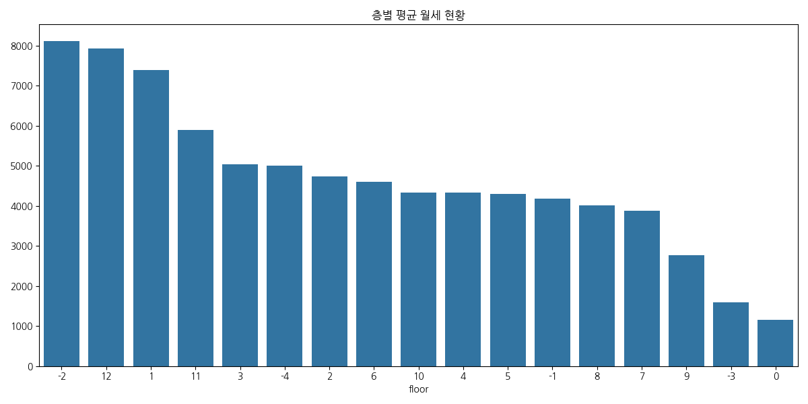

|   floor |   monthlyRent |
|--------:|--------------:|
|      -2 |       8125    |
|      12 |       7933.33 |
|       1 |       7388.2  |
|      11 |       5900    |
|       3 |       5032.18 |
|      -4 |       5000    |
|       2 |       4738.58 |
|       6 |       4606.82 |
|      10 |       4340    |
|       4 |       4327.37 |
|       5 |       4296.28 |
|      -1 |       4187.22 |
|       8 |       4016.25 |
|       7 |       3885.83 |
|       9 |       2770    |
|      -3 |       1600    |
|       0 |       1150    |

**분석 결과 해석**: 층수에 따른 임대료 차이는 상업용 부동산의 핵심 요소로, 접근성이 좋은 저층부와 대형 평수가 많은 고층부 사이의 가격 형성 원리를 이해할 수 있습니다.

### 역세권 유무에 따른 조회수 분포

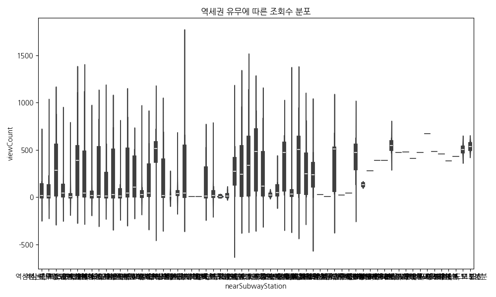

| nearSubwayStation   |   count |     mean |      std |   min |    25% |   50% |    75% |   max |
|:--------------------|--------:|---------:|---------:|------:|-------:|------:|-------:|------:|
|                     |       4 | 538      |  43.9166 |   487 | 511.75 | 538.5 | 564.75 |   588 |
| 강남역, 도보 10분         |      15 | 121.2    | 211.897  |     5 |   6.5  |  13   |  75.5  |   569 |
| 강남역, 도보 11분         |      15 | 280.867  | 256.007  |    10 |  43.5  | 250   | 451.5  |   807 |
| 강남역, 도보 12분         |      14 | 141.286  | 211.382  |     6 |   8.5  |  15   | 306    |   526 |
| 강남역, 도보 13분         |       5 |  28.2    |  18.431  |    10 |  21    |  23   |  28    |    59 |
| 강남역, 도보 15분         |       1 | 413      | nan      |   413 | 413    | 413   | 413    |   413 |
| 강남역, 도보 2분          |       7 | 350      | 278.027  |    27 |  80.5  | 474   | 568    |   652 |
| 강남역, 도보 3분          |      15 | 403.267  | 321.562  |    16 |  82.5  | 484   | 711.5  |   914 |
| 강남역, 도보 4분          |      27 | 375.556  | 366.767  |     8 |  31    | 338   | 628.5  |  1140 |
| 강남역, 도보 5분          |      42 | 249.381  | 305.264  |     4 |  16    |  46.5 | 472.25 |  1117 |
| 강남역, 도보 6분          |      40 | 320.025  | 291.603  |     4 |  31.5  | 388   | 532.25 |  1108 |
| 강남역, 도보 7분          |      12 | 305.167  | 319.479  |     9 |  24    | 241.5 | 529.75 |   956 |
| 강남역, 도보 8분          |       4 | 439.5    | 304.944  |     5 | 385.25 | 517   | 571.25 |   719 |
| 강남역, 도보 9분          |      14 | 251      | 275.489  |    10 |  26    | 118   | 469.5  |   835 |
| 교대(법원.검찰청)역, 도보 12분 |       1 |  46      | nan      |    46 |  46    |  46   |  46    |    46 |
| 교대(법원.검찰청)역, 도보 4분  |       1 |  10      | nan      |    10 |  10    |  10   |  10    |    10 |
| 교대(법원.검찰청)역, 도보 5분  |       1 |  30      | nan      |    30 |  30    |  30   |  30    |    30 |
| 교대(법원.검찰청)역, 도보 8분  |       2 | 238      | 329.512  |     5 | 121.5  | 238   | 354.5  |   471 |
| 교대(법원.검찰청)역, 도보 9분  |       5 | 364      | 287.013  |    39 |  78    | 509   | 518    |   676 |
| 교대역, 도보 11분         |       1 | 386      | nan      |   386 | 386    | 386   | 386    |   386 |
| 교대역, 도보 5분          |       1 | 434      | nan      |   434 | 434    | 434   | 434    |   434 |
| 교대역, 도보 6분          |       2 | 506      |  59.397  |   464 | 485    | 506   | 527    |   548 |
| 교대역, 도보 7분          |       1 | 674      | nan      |   674 | 674    | 674   | 674    |   674 |
| 교대역, 도보 8분          |       1 | 473      | nan      |   473 | 473    | 473   | 473    |   473 |
| 교대역, 도보 9분          |       1 | 474      | nan      |   474 | 474    | 474   | 474    |   474 |
| 사평역, 도보 8분          |       1 | 281      | nan      |   281 | 281    | 281   | 281    |   281 |
| 신논현역, 도보 1분         |       1 |   9      | nan      |     9 |   9    |   9   |   9    |     9 |
| 신논현역, 도보 2분         |      11 | 169      | 313.449  |    16 |  23    |  33   |  66    |   988 |
| 신논현역, 도보 3분         |      30 |  95.1667 | 187.439  |     6 |  13.25 |  28   |  52.75 |   783 |
| 신논현역, 도보 4분         |      25 | 260.56   | 293.134  |     6 |  20    |  46   | 503    |   845 |
| 신논현역, 도보 5분         |      22 | 302.318  | 271.294  |     0 |  29    | 283   | 544.5  |   878 |
| 신논현역, 도보 6분         |      25 | 297.2    | 349.646  |     5 |  12    |  43   | 535    |  1408 |
| 신논현역, 도보 7분         |      10 | 421      | 349.267  |     3 |  55    | 504.5 | 629.25 |   943 |
| 신논현역, 도보 8분         |       2 | 132.5    |  14.8492 |   122 | 127.25 | 132.5 | 137.75 |   143 |
| 양재(서초구청)역, 도보 10분   |       5 |  44.6    |  72.913  |    10 |  11    |  13   |  14    |   175 |
| 양재(서초구청)역, 도보 11분   |      13 | 218.462  | 292.617  |     4 |   7    |  29   | 495    |   733 |
| 양재(서초구청)역, 도보 12분   |       6 |  24.8333 |  26.888  |     8 |  11    |  12.5 |  23.75 |    78 |
| 양재(서초구청)역, 도보 13분   |       1 |   8      | nan      |     8 |   8    |   8   |   8    |     8 |
| 양재역(서초구청), 도보 10분   |       2 | 548      | 106.066  |   473 | 510.5  | 548   | 585.5  |   623 |
| 양재역(서초구청), 도보 11분   |       1 |  21      | nan      |    21 |  21    |  21   |  21    |    21 |
| 양재역(서초구청), 도보 12분   |       1 | 478      | nan      |   478 | 478    | 478   | 478    |   478 |
| 양재역(서초구청), 도보 13분   |       1 | 459      | nan      |   459 | 459    | 459   | 459    |   459 |
| 언주역, 도보 3분          |      14 | 148.357  | 222.574  |    10 |  19    |  42   | 124.75 |   692 |
| 언주역, 도보 4분          |       3 | 412.333  | 247.334  |   140 | 307    | 474   | 548.5  |   623 |
| 언주역, 도보 5분          |       4 |  12      |   8.0829 |     5 |   6.5  |  10   |  15.5  |    23 |
| 언주역, 도보 6분          |       8 |  90.5    | 100.611  |    16 |  27.5  |  47   | 115.5  |   310 |
| 언주역, 도보 7분          |       2 | 276      | 371.938  |    13 | 144.5  | 276   | 407.5  |   539 |
| 언주역, 도보 9분          |       1 | 484      | nan      |   484 | 484    | 484   | 484    |   484 |
| 역삼역, 도보 10분         |       9 |  90.5556 | 151.13   |    18 |  34    |  39   |  57    |   492 |
| 역삼역, 도보 11분         |       6 | 186.167  | 249.115  |     5 |  23.25 |  45   | 339    |   569 |
| 역삼역, 도보 12분         |      18 | 207.444  | 207.002  |     6 |  16    | 106   | 421    |   505 |
| 역삼역, 도보 13분         |       6 | 113.833  | 183.85   |     6 |  10.25 |  17.5 | 129    |   468 |
| 역삼역, 도보 14분         |       1 | 392      | nan      |   392 | 392    | 392   | 392    |   392 |
| 역삼역, 도보 2분          |      11 | 201.273  | 296.195  |     9 |  12    |  18   | 387.5  |   686 |
| 역삼역, 도보 3분          |      29 | 138.138  | 225.109  |     5 |   9    |  15   | 115    |   810 |
| 역삼역, 도보 4분          |      41 | 112.561  | 206.553  |     3 |   8    |  16   |  51    |   780 |
| 역삼역, 도보 5분          |      49 | 156.102  | 255.845  |     4 |   7    |  14   | 248    |   956 |
| 역삼역, 도보 6분          |      25 | 224.48   | 297.286  |     4 |  13    |  18   | 523    |   825 |
| 역삼역, 도보 7분          |      23 | 114.609  | 199.176  |     4 |  12.5  |  18   |  55.5  |   578 |
| 역삼역, 도보 8분          |      13 |  58.6154 | 162.795  |     5 |   8    |   9   |  21    |   599 |
| 역삼역, 도보 9분          |       1 | 388      | nan      |   388 | 388    | 388   | 388    |   388 |

**분석 결과 해석**: 역세권 매물이 비역세권 매물에 비해 사용자들에게 더 많이 노출되거나 관심을 받는 경향이 있는지 분포의 형태를 통해 확인할 수 있습니다.

### 변수 간 상관관계 히트맵

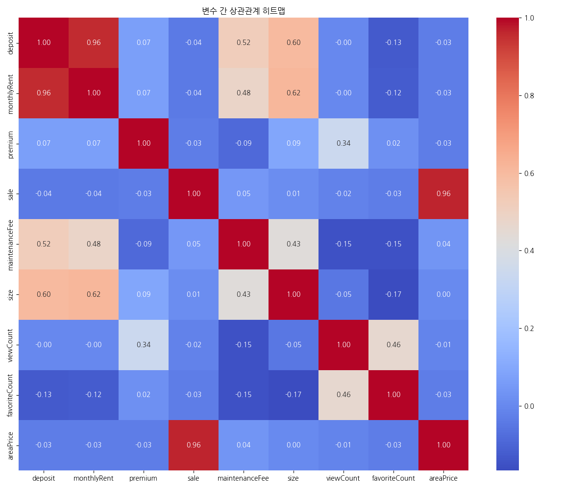

|                |     deposit |   monthlyRent |    premium |       sale |   maintenanceFee |        size |   viewCount |   favoriteCount |   areaPrice |
|:---------------|------------:|--------------:|-----------:|-----------:|-----------------:|------------:|------------:|----------------:|------------:|
| deposit        |  1          |    0.95891    |  0.0654169 | -0.0439244 |        0.517942  |  0.599286   | -0.00215665 |      -0.128158  | -0.03042    |
| monthlyRent    |  0.95891    |    1          |  0.0698856 | -0.0438675 |        0.483207  |  0.615646   | -0.00281773 |      -0.122848  | -0.0305547  |
| premium        |  0.0654169  |    0.0698856  |  1         | -0.0325055 |       -0.0854254 |  0.0891673  |  0.339989   |       0.0201512 | -0.0306936  |
| sale           | -0.0439244  |   -0.0438675  | -0.0325055 |  1         |        0.0468862 |  0.0133437  | -0.0178838  |      -0.0335886 |  0.96413    |
| maintenanceFee |  0.517942   |    0.483207   | -0.0854254 |  0.0468862 |        1         |  0.429783   | -0.151042   |      -0.152116  |  0.0366438  |
| size           |  0.599286   |    0.615646   |  0.0891673 |  0.0133437 |        0.429783  |  1          | -0.0491271  |      -0.16718   |  0.00199658 |
| viewCount      | -0.00215665 |   -0.00281773 |  0.339989  | -0.0178838 |       -0.151042  | -0.0491271  |  1          |       0.457493  | -0.0123886  |
| favoriteCount  | -0.128158   |   -0.122848   |  0.0201512 | -0.0335886 |       -0.152116  | -0.16718    |  0.457493   |       1         | -0.034504   |
| areaPrice      | -0.03042    |   -0.0305547  | -0.0306936 |  0.96413   |        0.0366438 |  0.00199658 | -0.0123886  |      -0.034504  |  1          |

**분석 결과 해석**: 여러 수치형 변수들 사이의 밀접도를 한눈에 파악할 수 있으며, 특히 보증금, 월세, 면적 사이의 강한 연관성이 데이터로 증명됩니다.

### 업종별 평균 관리비 (Top 20)

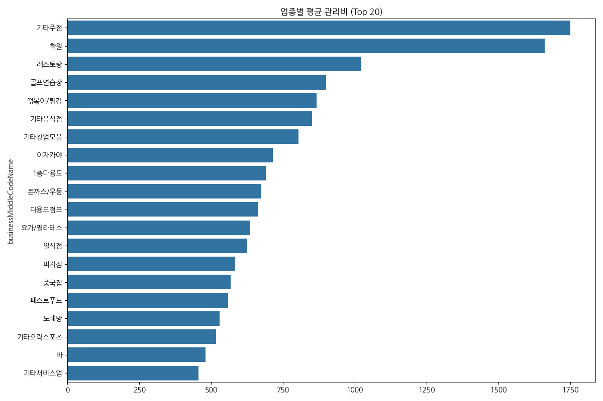

| businessMiddleCodeName   |   maintenanceFee |
|:-------------------------|-----------------:|
| 기타주점                     |         1750     |
| 학원                       |         1660     |
| 레스토랑                     |         1020     |
| 골프연습장                    |          900     |
| 떢볶이/튀김                   |          866.667 |
| 기타음식점                    |          851.25  |
| 기타창업모음                   |          804.015 |
| 이자카야                     |          715     |
| 1층다용도                    |          690     |
| 돈까스/우동                   |          675     |
| 다용도점포                    |          661.667 |
| 요가/필라테스                  |          636.364 |
| 일식점                      |          625     |
| 피자점                      |          583.333 |
| 중국집                      |          568.571 |
| 패스트푸드                    |          560     |
| 노래방                      |          530     |
| 기타오락스포츠                  |          516.667 |
| 바                        |          480     |
| 기타서비스업                   |          455.455 |

**분석 결과 해석**: 특정 업종(예: 대형 오피스, 특수 시설)에서 관리비 부담이 높게 나타나는 것을 알 수 있으며, 이는 업종 선택 시 고려해야 할 중요 비용 요소입니다.

## 4. 텍스트 분석 (매물 제목 키워드)

### 매물 제목 주요 키워드 분석 (TF-IDF)

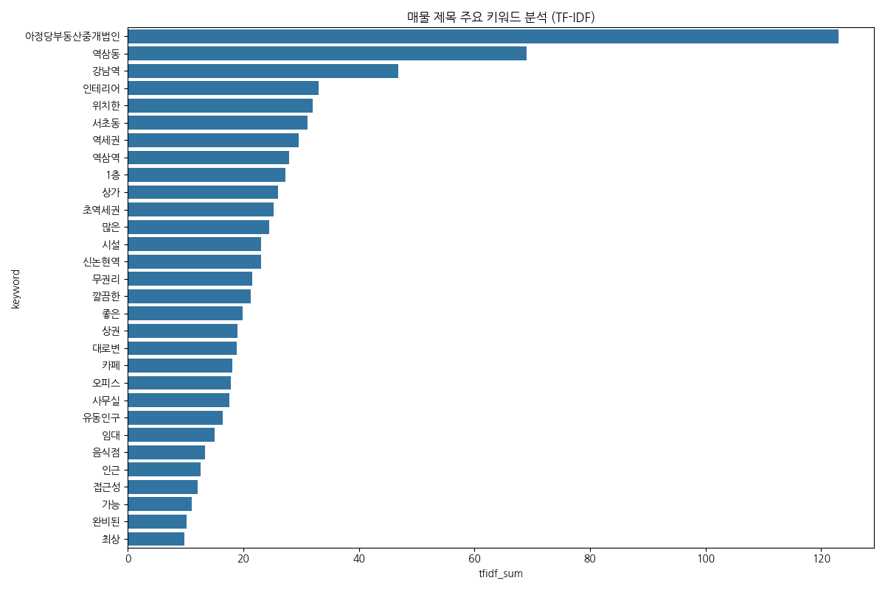

|    | keyword    |   tfidf_sum |
|---:|:-----------|------------:|
| 13 | 아정당부동산중개법인 |   123       |
| 14 | 역삼동        |    69.0615  |
|  2 | 강남역        |    46.7546  |
| 23 | 인테리어       |    33.0063  |
| 19 | 위치한        |    31.9475  |
| 10 | 서초동        |    31.0608  |
| 16 | 역세권        |    29.6098  |
| 15 | 역삼역        |    27.9835  |
|  0 | 1층         |    27.2766  |
|  8 | 상가         |    26.0061  |
| 27 | 초역세권       |    25.286   |
|  5 | 많은         |    24.4494  |
| 11 | 시설         |    23.0956  |
| 12 | 신논현역       |    23.0543  |
|  6 | 무권리        |    21.5323  |
|  3 | 깔끔한        |    21.3057  |
| 26 | 좋은         |    19.9328  |
|  9 | 상권         |    18.9628  |
|  4 | 대로변        |    18.8025  |
| 29 | 카페         |    18.0736  |
| 17 | 오피스        |    17.8611  |
|  7 | 사무실        |    17.5637  |
| 20 | 유동인구       |    16.4574  |
| 24 | 임대         |    15.0488  |
| 21 | 음식점        |    13.3518  |
| 22 | 인근         |    12.5475  |
| 25 | 접근성        |    12.1015  |
|  1 | 가능         |    11.1187  |
| 18 | 완비된        |    10.1964  |
| 28 | 최상         |     9.83878 |

**분석 결과 해석**: 매물 제목에서 추출된 핵심 키워드들은 현재 시장에서 강조하는 셀링 포인트(예: 역세권, 급매, 시설권리 등)를 명확히 보여줍니다.

## 5. 결론 및 종합 제언

본 분석을 통해 네모 플랫폼의 데이터는 상업용 부동산 시장의 실제 현황을 매우 정교하게 반영하고 있음을 확인하였습니다. 주요 수치 데이터의 분포는 안정적인 편이며, 범주형 데이터는 풍부한 비즈니스 인사이트를 담고 있습니다. 

특히 역세권 입지와 업종별 가격 편차는 향후 매물 추천 알고리즘 고도화 시 핵심 피처로 활용될 가치가 충분합니다. 또한, 사용자 반응 데이터(조회수, 관심수)를 결합한 분석을 통해 매물의 '매력도'를 정량화할 수 있는 가능성을 확인하였습니다.

데이터 분석가로서 본 데이터셋은 단순한 정보의 나열을 넘어, 상권 분석과 부동산 트렌드 예측을 위한 훌륭한 자산이라고 평가합니다. 향후 시계열 데이터가 확보된다면 가격 변동 추이 분석을 통해 더욱 강력한 시장 통찰을 제공할 수 있을 것입니다.

